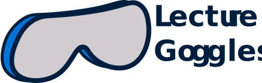

# Lecture Goggles Frontend




This repository contains all of the code for the frontend. Lecture Goggles is a
free, open-source, educational resource repository to help students gain a better
understanding of school subjects.

## How to run

```BASH
$ git clone https://github.com/LectureGoggles/lecture-goggles-frontend.git
$ npm install
$ npm start
# OR
$ npm test
# OR
$ npm run build
```

## Build Status

TODO

## How to Contribute

See [CONTRIBUTING.md](CONTRIBUTING.md)

## Tech Stack

- React
- Jest
- Styled Components
- Eslint / Prettier (Airbnb Style)
